```mermaid
classDiagram
direction TB

class Executor {
    <<interface>>
    +execute(Runnable command)
}

class ExecutorService {
    <<interface>>
    +submit(Callable<T> task) : Future<T>
    +invokeAll(Collection<Callable<T>> tasks) : List<Future<T>>
    +shutdown()
}

class ScheduledExecutorService {
    <<interface>>
    +schedule(Runnable command, long delay, TimeUnit unit)
    +scheduleAtFixedRate(Runnable command, long initialDelay, long period, TimeUnit unit)
}

class ForkJoinPool {
    +invoke(ForkJoinTask<T> task) : T
    +submit(ForkJoinTask<T> task) : ForkJoinTask<T>
    +execute(ForkJoinTask<?> task)
}

class ForkJoinTask {
    <<abstract>>
    +fork()
    +join()
    +compute()
}

class RecursiveTask {
    <<abstract>>
    +compute() : T
}

class RecursiveAction {
    <<abstract>>
    +compute()
}

class ThreadPoolExecutor {
    +execute(Runnable command)
    +shutdown()
}

class ScheduledThreadPoolExecutor {
    +schedule(Runnable command, long delay, TimeUnit unit)
    +scheduleAtFixedRate(Runnable command, long initialDelay, long period, TimeUnit unit)
}

class Semaphore {
    +acquire()
    +release()
}

class ReentrantLock {
    +lock()
    +unlock()
    +tryLock()
}

class ReadWriteLock {
    <<interface>>
    +readLock() : Lock
    +writeLock() : Lock
}

class CountDownLatch {
    +await()
    +countDown()
}

class CyclicBarrier {
    +await()
}

class AtomicInteger {
    +incrementAndGet() : int
    +decrementAndGet() : int
    +compareAndSet(int expected, int newValue) : boolean
}

class ConcurrentHashMap {
    +putIfAbsent(K key, V value) : V
    +computeIfAbsent(K key, Function<K,V> mappingFunction) : V
}

class BlockingQueue {
    <<interface>>
    +put(E e)
    +take() : E
}

class ArrayBlockingQueue {
    +put(E e)
    +take() : E
}

class LinkedBlockingQueue {
    +put(E e)
    +take() : E
}

class PriorityBlockingQueue {
    +put(E e)
    +take() : E
}

Executor <|-- ExecutorService
ExecutorService <|-- ThreadPoolExecutor
ExecutorService <|-- ScheduledExecutorService
ScheduledExecutorService <|-- ScheduledThreadPoolExecutor


ForkJoinPool --> ForkJoinTask
ForkJoinTask <|-- RecursiveTask
ForkJoinTask <|-- RecursiveAction


ReadWriteLock --> ReentrantLock


BlockingQueue <|-- ArrayBlockingQueue
BlockingQueue <|-- LinkedBlockingQueue
BlockingQueue <|-- PriorityBlockingQueue

```

# Multithreading, Concurrency & Parallelism
* java.util.concurrent package in Java is designed to support both concurrency and parallelism
* Multithreading: Multithreading is a specific technique used to achieve concurrency in a single program. It involves 
  creating multiple, independent units of execution (threads) within a single program that share the same resources, 
  such as memory and I/O.
* concurrency: interleaving multiple tasks, e.g., when one task is waiting on i/o another task can be  executed, so
  progress is made on multiple tasks
    *  ConcurrentHashMap and BlockingQueue
* parallelism: is about executing multiple tasks at the same time, leveraging multiple CPU's to run code simultaneously
    * ForkJoinPool and associated ForkJoinTask and RecursiveTask
    * does not create new operating system processes; Uses a pool of worker threads within a single Java Virtual 
      Machine (JVM) process
* thread: A lightweight execution units within a single process sharing the resources of the  process
* Process: An independent execution unit with it's own memory space

## java.util.concurrent package
* Concurrent Collections: Instead of the basic Collections.synchronizedList wrapper with blocking access to the entire 
  collection, locks are used on data segments or lock-free (CAS)
  * ConcurrentHashMap: high-performance concurrent thread-safe access  without blocking
    * partitioning the hash table into **segments (pre - java 8)**, each guarded by a separate lock
    * **Node-based Locking with CAS (java 8)** and fine-grained lock
    * Non-Blocking Reads: Retrieval operations, such as get()
    * Atomic Operations:  putIfAbsent(), compute(), merge(), and replace()
    * Weakly Consistent Iterators: Iterators on a ConcurrentHashMap are "weakly consistent". This means they reflect 
      the state of the map at the time the iterator was created and may or may not reflect modifications that occur  
      after the iterator is created, but they are guaranteed not to throw a ConcurrentModificationException
  * CopyOnWriteArrayList: ideal for mostly read-only or where concurrent modifications are infrequent.
* Queues: non-blocking (for speed and operation without blocking threads) and blocking queues (“slow down” the 
  “Producer” or “Consumer” threads if some conditions are not met)
  * ConcurrentLinkedQueue: high-concurrency + non-blocking implementation of the Queue interface
  * BlockingQueue Implementations: LinkedBlockingQueue + ArrayBlockingQueue
  * PriorityBlockingQueue: "unbounded priority queue that orders elements by natural order or Comparator"
* Locks:  flexible thread synchronization (vs the basic synchronized, wait, notify, notifyAll)
  * Locks/ReentrantLock
  * Conditions
* Synchronizers: auxiliary utilities for synchronizing threads.
  * Semaphores (control access to a shared resource using "limited number of permits" + acquire and release permits)
    * there can be 0 or -ve permits, acquire() is blocked if 0 or -ve permits
    * can release before acquiring
    * can release multiple permits
    * ### API:
      * acquire() 
      * release()
  * Consider using higher-level abstractions like ConcurrentHashMap and ConcurrentLinkedQueue for thread-safe data
    structures instead of manual synchronization with locks.
* Executors: creating & managing thread pools, scheduling asynchronous tasks
  * Executor: execute(Runnable)
    * "central abstraction for managing threads"
    * "decouple" task submission from the thread creation
  * Executors: Utility class for a variety of factory methods
    * fixed-size thread pools, cached thread pools, and scheduled thread pools.
  * ExecutorService: support for Callable returning Future  + control over
    * manage and orchestrate thread execution
  * ThreadPoolExecutor implements ExecutorService interface
    * customization of core pool size, maximum pool size, thread keep-alive time, work queue (Task queuing features 
      like bounded queues, unbounded queues, synchronous queues), and thread factory
    * corePoolSize: number of threads the pool will try to keep running, even if they are idle (unless 
      allowCoreThreadTimeOut is set)
    * number of active threads dynamically changes based on the workload, up to the limits of corePoolSize and 
      maximumPoolSize
    * ThreadPoolExecutor manages task queuing via BlockingQueue<Runnable> implementations
      * ArrayBlockingQueue (Task size is Fixed/Bounded): if new task added after maxPoolsize + queue size then tasks are
        handled using "RejectedExecutionHandler"
      * LinkedBlockingQueue (Task size is Unbounded): Without a specified capacity tasks queue indefinitely; caps 
        threads at corePoolSize (no practical effect of maximumPoolSize); possible OOM => predictable workload
      * SynchronousQueue(Task size is 0, Synchronous/direct handoff): direct handoff to a core thread or new thread 
        upto maximumPoolSize is created to handle the task or rejection if maximumPoolSize is reached
    * Consider using managed executors like ForkJoinPool for CPU-bound tasks 
    * Cached thread pools for I/O-bound tasks
      * Creates new threads as needed and reuses idle ones
      * Cached thread pools can grow to Integer.MAX_VALUE, which, if not managed, can lead to out-of-memory errors if 
        too many tasks are submitted
      * Best suited for applications with many short-lived or high-latency I/O tasks
* Atomics: support for atomic operations on primitives and references

## Scenario: Handle Burst Tasks using Thread Pool Executor
* Burst: sudden, high-volume spikes in workload 
* prioritize immediate task processing (low latency) or resource stability (preventing server crashes)
* For High-Responsiveness Bursts: SynchronousQueue (Direct Handoff) 
  * Caveat: You must set a large or unbounded maximumPoolSize and use a RejectedExecutionHandler (like CallerRunsPolicy) 
    to avoid losing tasks if the thread limit is reached.
* For Resource-Controlled Bursts: Bounded Queue (ArrayBlockingQueue) or Linked Blocking Queues with capacity 
  * Caveat: prevents out-of-memory errors by rejecting tasks (or triggering backpressure) 
* "Unbounded Linked Blocking Queues": unsuitable because of OOM/Crashes

## ForkJoinPool:
* ForkJoinPool is a specialized ExecutorService implementation
* Task Decomposition with Fork-Join Model
* ForkJoinTask is the abstract base class for tasks managed by ForkJoinPool, representing a task that can be forked
  and joined
* To create a task, developers extend ForkJoinTask and implement the compute() method, which represents the task's
  execution logic.
* Tasks are submitted to ForkJoinPool using the pool's submit() or invoke() methods, initiating their execution within
  the pool.
* Particularly well-suited for implementing divide-and-conquer algorithms
* Proper tuning of ForkJoinPool parameters such as parallelism level, threshold size
* Worker/Stealing:
  * Why LIFO for own work, FIFO for stealing?
  * LIFO for own work: Better cache locality, work on most recently created (smaller) tasks
  * FIFO for stealing: Get larger tasks that will generate more sub-tasks, reducing future stealing
* ForkJoinPool.commonPool(): Java 8 introduced a shared pool for all Fork/Join operations

## Callable:
  Callable interface represents a task that returns a result and may throw a "checked exception" when executed by a  
  service like an ExecutorService

## Future:
  ExecutorService accepts an asynchronous task (Runnable or Callable) and returns a Future 
  Future is blocking when you call get()
  Status Checking and Cancellation: Methods like isDone(), isCancelled(), and cancel()
  **FutureTask:** A concrete class that implements both Future and Runnable
  

## CompletableFuture:
* powerful asynchronous programming model. It represents a future result of an asynchronous computation, providing a 
  flexible and expressive way to compose, combine, and execute asynchronous tasks.
* static factory methods:
    * CompletableFuture.completedFuture()
    * CompletableFuture.supplyAsync()
    * CompletableFuture.runAsync().
* fluent API for chaining: thenApply(), thenAccept(), thenRun(), thenCompose(), and thenCombine(). 
  // these are non-blocking allowing main thread to continue
* manual completion:
  * complete() 
  * completeExceptionally()
* Provides methods like orTimeout() and completeOnTimeout() for graceful timeout management.

## CountdownLatch:
* CountdownLatch is a synchronization
* CountdownLatch is initialized with a count representing the number of times the await() method must be invoked before 
  it allows waiting threads to proceed.
* Unlike Phasers, CountdownLatch does not support dynamic adjustment of the count once initialized. Once the count 
  reaches zero, it remains at zero, and subsequent calls to countDown() have no effect.
  * ### API:
    * await()
    * countDown()

## Phaser:
* a synchronization barrier that allows threads to synchronize their execution in multiple phases.
* Basics:
  * Phaser manages a set of registered parties (threads) that synchronize at a barrier point, known as a phase.
  * All registered parties must arrive before proceeding to the next phase.
  * Phases are numbered sequentially
* Phasers support dynamic adjustment of the number of registered parties and phases

## Exchanger:
* 2-thread data swap

## Common Combination Patterns
### ThreadPoolExecutor + BlockingQueue + Semaphore
  * This pattern combines rate limiting with task execution. The semaphore limits concurrent external calls while the 
    executor manages thread resources.
  * This combination lets you have many threads (for CPU work) while limiting how many call an external API 
    simultaneously.
```java
public class RateLimitedProcessor {
    private final ExecutorService executor;
    private final Semaphore rateLimiter;
    private final BlockingQueue<Task> workQueue;

    public RateLimitedProcessor(int poolSize, int maxConcurrentApiCalls,
            int queueCapacity) {
        this.executor = new ThreadPoolExecutor(
            poolSize, poolSize, 0L, TimeUnit.MILLISECONDS,
            new ArrayBlockingQueue<>(queueCapacity),
            new ThreadPoolExecutor.CallerRunsPolicy()
        );
        this.rateLimiter = new Semaphore(maxConcurrentApiCalls);
        this.workQueue = new LinkedBlockingQueue<>();
    }

    public void submit(Task task) {
        executor.submit(() -> {
            rateLimiter.acquire();  // Limit concurrent API calls
            try {
                callExternalApi(task);
            } finally {
                rateLimiter.release();
            }
        });
    }
}
```
### CountDownLatch + ConcurrentHashMap (Memoizing Cache)
* This pattern ensures expensive computations happen only once, even under concurrent requests.
* The first thread to request a key creates a FutureTask and runs it. Concurrent requests for the same key get the 
  same Future and wait for the result.
```java
public class MemoizingCache<K, V> {
    private final ConcurrentHashMap<K, Future<V>> cache = new ConcurrentHashMap<>();

    public V compute(K key, Function<K, V> computation) throws Exception {
        Future<V> future = cache.get(key);

        if (future == null) {
            FutureTask<V> newTask = new FutureTask<>(() -> computation.apply(key));
            future = cache.putIfAbsent(key, newTask);
            if (future == null) {
                future = newTask;
                newTask.run();  // First thread computes
            }
        }

        return future.get();  // All threads wait for same result
    }
}
```

### CyclicBarrier + ConcurrentHashMap (Phased Processing)
* This pattern coordinates multiple workers that process data in phases, aggregating results between phases.
  * ### API:
    * await() is the only method often used 
    * reset()
    * getNumberWaiting()
    * getParties()

### Dangerous Combinations to Avoid
* Warning: Queues + Barriers can cause deadlock. When threads waiting at a barrier also wait on a blocking queue, you 
can create a deadlock where no thread can proceed.
```java
// DANGEROUS: Potential deadlock!
CyclicBarrier barrier = new CyclicBarrier(3);
BlockingQueue<Task> queue = new ArrayBlockingQueue<>(1);  // Small capacity!

Runnable worker = () -> {
    while (true) {
        Task task = queue.take();  // Might block if queue empty
        process(task);
        barrier.await();  // Wait for others... but they might be stuck at take()!
    }
};
```

* References:
  * https://medium.com/@alxkm/unlocking-concurrent-power-a-guide-to-java-util-concurrent-pt-1-b1342edadad1
  * https://medium.com/@alxkm/unlocking-concurrent-power-a-guide-to-java-util-concurrent-pt-2-056f1da1e74a
  * https://algomaster.io/learn/concurrency-interview/java-util-concurrent-package-tour